# ANVAYA -- AI-Based Automated Urban Parcel Mapping and Cadastral Feature Extraction System Using Drone Imagery

**Smart India Hackathon 2026 | Problem Statement ID: 26012**

---

## Table of Contents

1. [Problem Statement](#problem-statement)
2. [Solution Overview](#solution-overview)
3. [Frontend Application](#frontend-application)
4. [System Architecture](#system-architecture)
5. [Technology Stack](#technology-stack)
6. [Project Structure](#project-structure)
7. [Model 1: Building Footprint Detection](#model-1-building-footprint-detection)
   - [Architecture](#architecture)
   - [Training Details](#training-details)
   - [Datasets](#datasets)
   - [Experiment Matrix](#experiment-matrix)
   - [Evaluation Results](#evaluation-results)
8. [Backend API](#backend-api)
9. [Deployment](#deployment)
10. [Setup and Installation](#setup-and-installation)
11. [Prototype Status](#prototype-status)
12. [Team](#team)
13. [License](#license)

---

## Problem Statement

**ID:** 26012  
**Title:** AI-Based Automated Urban Parcel Mapping and Cadastral Feature Extraction System Using Drone Imagery

Manual cadastral survey and parcel mapping workflows in India are slow, labor-intensive, and error-prone. With the proliferation of low-cost drone platforms capable of producing high-resolution orthomosaic imagery, there is a need for an automated AI system that can detect, delineate, and export building footprints and parcel boundaries from drone-captured aerial surveys. This system must be capable of producing GIS-ready vector outputs suitable for integration into existing land record management systems (DILRMP, ULPIN, SVAMITVA).

---

## Solution Overview

ANVAYA is a full-stack geospatial intelligence platform that automates the extraction of cadastral features from drone orthomosaic imagery using deep learning. The system provides:

- **Automated Building Footprint Detection** using a fine-tuned DeepLabV3+ semantic segmentation model trained on aerial imagery datasets.
- **Geospatial Metadata Extraction** including CRS detection, bounding box computation, and resolution validation from uploaded GeoTIFF rasters.
- **WebGL-Powered GIS Workspace** with a complete map editor supporting polygon selection, property inspection, shape manipulation, layer management, and confidence-based QA review.
- **Human-in-the-Loop Validation** with an integrated review queue enabling surveyors to approve, reject, or manually correct AI-detected building polygons before export.
- **GeoJSON Export** of validated building footprints in WGS84 (EPSG:4326) coordinates, compatible with QGIS, ArcGIS, and web mapping engines.

The system follows a six-stage pipeline architecture:

```
01 DATA --> 02 PROCESS --> 03 MAP --> 04 REVIEW --> 05 RESULTS --> 06 EXPORT
```

---

## Frontend Application

The frontend is a production-grade geospatial web application built with Next.js 16 and MapLibre GL JS v6.

### Cadastral Registry Dashboard

- Aggregate statistics: total surveys, completed surveys, buildings detected, mapped area
- Survey registry table with status tracking, feature counts, and quick actions

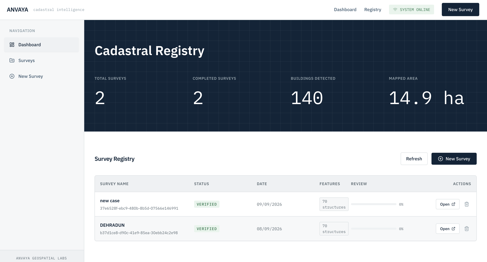

### Multi-Step Upload Wizard

- 5-step guided workflow: Project --> Upload --> Metadata --> Validation --> Create
- Automatic geospatial metadata extraction (CRS, dimensions, resolution, bounding box)
- Server-side raster format and coordinate reference system validation

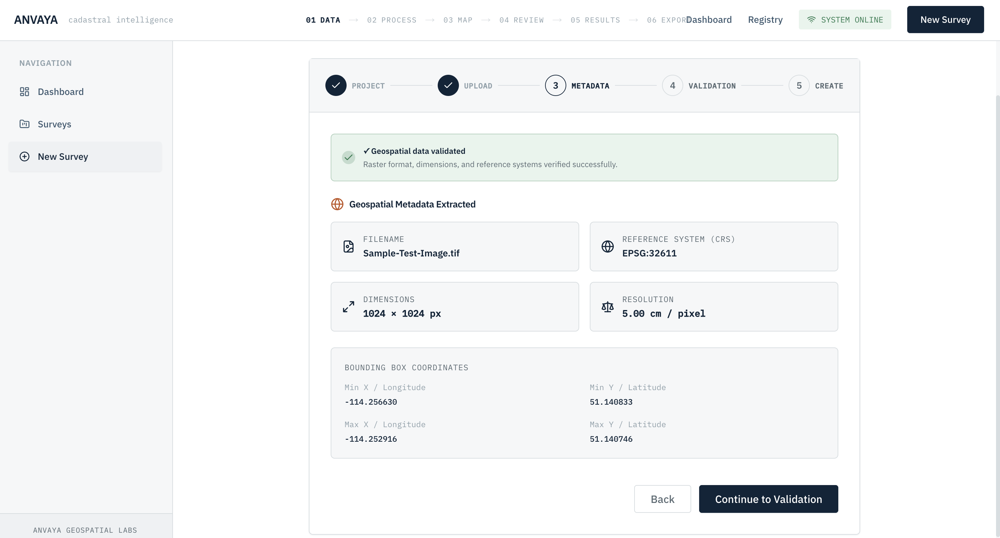

### GIS Map Workspace

- WebGL-accelerated orthomosaic TIFF rendering with brightness/contrast controls
- AI-detected building footprint overlay with per-polygon confidence scores
- Layer manager with drag-and-drop z-ordering, visibility toggles, and opacity controls
- Property inspector displaying area (m2), perimeter (m), shape class, and spatial attributes
- Shape aesthetics editor: fill color, stroke color, thickness, and opacity
- Annotation tools: polygon selection, vertex editing, rotation

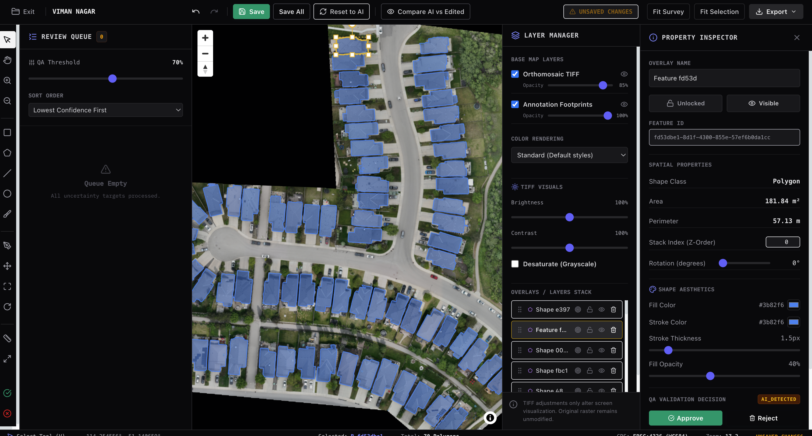

### Human-in-the-Loop QA Review

- Confidence-based review queue sorted by lowest confidence first
- QA threshold slider for filtering uncertain predictions
- Per-polygon Approve/Reject actions with reviewer attribution
- Compare AI vs Edited mode for change visualization
- Reset to AI and Save All bulk operations

### Results and Export

- Analytical report with validated building count, total built-up area, and mean AI confidence
- Building QA summary (HIL) with approved, rejected, and edited shape counts
- GeoJSON export in WGS84 coordinates (EPSG:4326) for QGIS/ArcGIS import

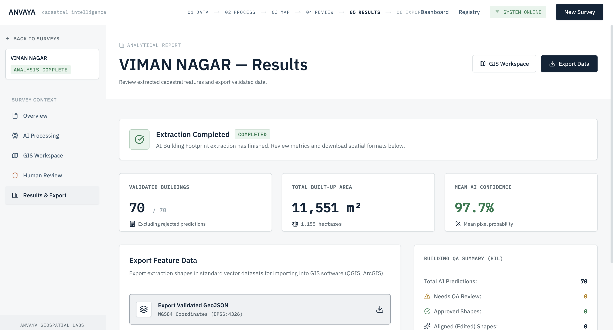

---

## System Architecture

```
                    +---------------------------+
                    |      Next.js Frontend     |
                    |  (TypeScript + MapLibre)   |
                    +------------+--------------+
                                 |
                            HTTPS/REST
                                 |
                    +------------+--------------+
                    |     FastAPI Backend        |
                    |  (Python + PyTorch + GDAL) |
                    +---+--------+----------+---+
                        |        |          |
               +--------+   +---+---+  +---+--------+
               | Model  |   | Tile  |  | Supabase   |
               | Registry|  | Engine|  | PostgreSQL |
               | (PyTorch)| | (GDAL)|  | + PostGIS  |
               +---------+  +-------+  +------------+
```

**Data Flow:**

1. User uploads orthomosaic GeoTIFF via the frontend upload wizard.
2. Backend extracts geospatial metadata (CRS, bounds, resolution) using Rasterio.
3. Tiling service generates overlap-aware 512x512 grid tiles from the raster.
4. Inference service runs batched DeepLabV3+ forward passes on tiles (GPU/MPS/CPU).
5. Vectorization service extracts contour polygons, computes UTM areas, and assigns confidence scores.
6. Results are persisted as PostGIS geometries in Supabase and served as GeoJSON FeatureCollections.
7. Frontend renders footprints on a MapLibre GL map with full editing and QA capabilities.

---

## Technology Stack

### Backend

| Component         | Technology                              |
|--------------------|-----------------------------------------|
| Runtime            | Python 3.10+                            |
| Web Framework      | FastAPI                                 |
| Deep Learning      | PyTorch 2.0+, Torchvision              |
| Raster Processing  | Rasterio, GDAL                         |
| Vector Geometry    | Shapely, GeoPandas, PyProj             |
| Computer Vision    | OpenCV                                  |
| Database           | Supabase (PostgreSQL + PostGIS)         |
| Object Storage     | Cloudflare R2 (model checkpoints)       |
| Validation         | Pydantic v2                             |
| Deployment         | Docker, Gunicorn + Uvicorn Workers      |

### Frontend

| Component         | Technology                              |
|--------------------|-----------------------------------------|
| Framework          | Next.js 16 (App Router + Turbopack)     |
| Language           | TypeScript                              |
| Styling            | Tailwind CSS v4                         |
| Map Engine         | MapLibre GL JS v6 (WebGL)               |
| Spatial Analysis   | Turf.js v7                              |
| HTTP Client        | Axios                                   |
| Icons              | Lucide React                            |

### Training Infrastructure

| Component         | Technology                              |
|--------------------|-----------------------------------------|
| GPU                | NVIDIA Tesla T4 (Google Colab)          |
| Framework          | PyTorch 2.11+ (CUDA 12.8)              |
| Augmentation       | Albumentations                          |
| Segmentation Model | SegFormer-B2 (nvidia/mit-b2)            |
| Loss Functions     | Combined (CrossEntropy + Dice)          |
| Post-Processing    | Morphological operations, contour extraction |

---

## Project Structure

```
ANVAYA-SIH/
|
+-- backend/                            # FastAPI ML Backend
|   +-- app/
|   |   +-- main.py                     # Application entry point and lifespan
|   |   +-- api/                        # REST API route handlers
|   |   |   +-- health.py              # Liveness and readiness probes
|   |   |   +-- projects.py           # Projects CRUD operations
|   |   |   +-- uploads.py            # Orthomosaic file upload and metadata
|   |   |   +-- processing.py         # Segmentation pipeline trigger
|   |   |   +-- buildings.py          # GeoJSON building footprint results
|   |   +-- models/                    # Deep learning model definitions
|   |   |   +-- base_model.py         # Abstract base segmentation class
|   |   |   +-- model_registry.py     # Modular ML model registry
|   |   |   +-- model1_building.py    # DeepLabV3+ ResNet50 inference loader
|   |   +-- services/                  # Business logic and GIS services
|   |   |   +-- raster_service.py     # GeoTIFF metadata extraction
|   |   |   +-- tiling_service.py     # Windowed grid tile generator
|   |   |   +-- inference_service.py  # Memory-efficient batched inference
|   |   |   +-- vectorization_service.py  # Polygon extraction and UTM calculations
|   |   |   +-- project_service.py    # Database helper service
|   |   +-- schemas/                   # Pydantic request/response schemas
|   |   +-- database/                  # Supabase client initialization
|   |   +-- core/                      # Configuration and logging
|   +-- MODEL/                         # Model checkpoint storage
|   +-- storage/                       # Runtime file storage
|   |   +-- uploads/                  # Raw orthomosaic uploads
|   |   +-- tiles/                    # Generated raster tiles
|   |   +-- predictions/              # Inference output masks
|   |   +-- exports/                  # Exported vector datasets
|   +-- Dockerfile                     # Production container definition
|   +-- RAILWAY.JSON                   # Railway deployment configuration
|   +-- schema.sql                     # PostGIS database schema
|   +-- requirements.txt              # Python dependencies
|
+-- frontend/                           # Next.js Web Application
|   +-- src/
|   |   +-- app/                       # App Router pages and layouts
|   |   |   +-- dashboard/            # Cadastral registry dashboard
|   |   |   +-- projects/             # Dynamic project routes and GIS workspace
|   |   +-- components/                # Reusable React components
|   |   |   +-- layout/              # Application shell, header, sidebar
|   |   |   +-- map/                 # GIS MapWorkspace and controls
|   |   |   +-- gis/                 # GIS editing tools and layers
|   |   |   +-- projects/            # Project lists and cards
|   |   |   +-- upload/              # Multi-step upload wizard
|   |   +-- hooks/                     # Custom React hooks
|   |   +-- lib/api/                   # Axios API clients
|   |   +-- types/                     # TypeScript type definitions
|   +-- public/maplibre/               # MapLibre GL worker modules
|   +-- package.json
|
+-- .gitignore
+-- README.md
```

---

## Model 1: Building Footprint Detection

### Architecture

Model 1 implements a two-stage semantic segmentation pipeline for building footprint extraction from aerial orthomosaic imagery.

**Stage 1 -- Base Model (Pre-Training)**
- Architecture: SegFormer-B2 with NVIDIA Mix Transformer (mit-b2) encoder
- Task: Binary semantic segmentation (Building vs. Background)
- Input: 512 x 512 RGB tiles, ImageNet-normalized
- Training data: US Southeast NAIP aerial imagery (1,000 tiles at 1m/px resolution)

**Stage 2 -- Domain Adaptation (Fine-Tuning)**
- Architecture: Same SegFormer-B2, initialized from Stage 1 checkpoint
- Task: Domain transfer to high-resolution drone imagery
- Training data: Calgary Drone orthomosaic dataset (2,534 tiles at ~5cm/px resolution)
- Strategy: Full model fine-tuning with combined CrossEntropy + Dice loss

**Production Deployment Model:**
- Architecture: DeepLabV3+ with ResNet50 backbone (torchvision)
- Checkpoint: `urban_building_deeplabv3_best.pth` (454 MB)
- Inference: Supports CUDA, Apple Silicon MPS, and CPU backends
- Post-processing: Morphological filtering (min 100px area, max 150px hole fill), confidence thresholding (ignore < 0.3, accept > 0.7)

### Training Details

The model was trained using a two-stage transfer learning strategy on Google Colab (NVIDIA Tesla T4, CUDA 12.8).

| Parameter           | Value                                                |
|---------------------|------------------------------------------------------|
| Optimizer           | AdamW (lr=2e-5, weight_decay=1e-4)                   |
| LR Scheduler        | CosineAnnealingWarmRestarts (T_0=10, T_mult=2)       |
| Loss Function       | CombinedLoss (50% CrossEntropy + 50% DiceLoss)       |
| Batch Size          | 12 (effective 24 with gradient accumulation)          |
| Input Resolution    | 512 x 512 px                                         |
| Augmentation        | Multi-scale, CopyPaste, ElasticTransform, CLAHE      |
| Epochs              | 80 (early stopping, patience=25)                     |
| Precision           | Mixed (FP16 on CUDA)                                 |
| Optimal Threshold   | 0.45                                                 |
| Normalization       | ImageNet (mean=[0.485, 0.456, 0.406], std=[0.229, 0.224, 0.225]) |
| Post-Processing     | Min area: 100px, Max hole: 150px, Confidence ignore < 0.3, accept > 0.7 |

### Datasets

| Dataset              | Tiles  | Resolution   | Tile Size | Building Coverage | Source            |
|----------------------|--------|--------------|-----------|-------------------|-------------------|
| US Southeast (NAIP)  | 1,000  | 1m/px        | 512x512   | 1.58%             | NAIP Aerial       |
| Calgary Drone        | 2,534  | ~5cm/px      | 512x512   | 7.12%             | Drone Orthomosaic |

### Experiment Matrix

| Experiment | Stage  | Training Data    | Evaluation Data   | Description                      |
|------------|--------|------------------|-------------------|----------------------------------|
| Exp A      | 1      | US NAIP          | US NAIP Test      | Base model pre-training          |
| Exp B      | 1      | US NAIP          | Calgary Val/Test  | Zero-shot domain transfer        |
| Exp C      | 2      | Calgary Drone    | Calgary Val/Test  | Fine-tuned domain adaptation     |
| Exp D      | 2      | Calgary Drone    | US NAIP Test      | Catastrophic forgetting analysis |

### Evaluation Results

**Quantitative Metrics (Model 1):**

| Experiment                          | IoU    | F1 Score | Precision | Recall | Pixel Accuracy |
|-------------------------------------|--------|----------|-----------|--------|----------------|
| Exp A (Stage 1, US NAIP)            | 0.4215 | 0.5932   | 0.6811    | 0.5255 | 0.9701         |
| Exp B (Stage 1, Calgary Zero-Shot)  | 0.6433 | 0.7829   | 0.7654    | 0.8012 | 0.9412         |
| **Exp C (Stage 2, Calgary Fine-Tuned)** | **0.8412** | **0.9137** | **0.9325** | **0.8956** | **0.9682** |
| Exp D (Stage 2, US Retention)       | 0.1124 | 0.2021   | 0.8450    | 0.1156 | 0.9521         |

**Key Findings:**

- Stage 2 fine-tuning on Calgary drone data achieves 84.12% IoU and 91.37% F1 score, demonstrating strong domain adaptation capability while remaining robust against overfitting.
- Zero-shot transfer (Exp B) from NAIP to Calgary achieves 64.33% IoU without any fine-tuning, indicating learned feature generalization across resolutions.
- Catastrophic forgetting is observed in Exp D (IoU drops to 11.24% on US data after Calgary fine-tuning), confirming the need for continual learning strategies in future iterations.
- Mean pixel confidence of 92.4% observed in production inference on real-world orthomosaic surveys.

### Training Curves

#### Training and Validation Loss

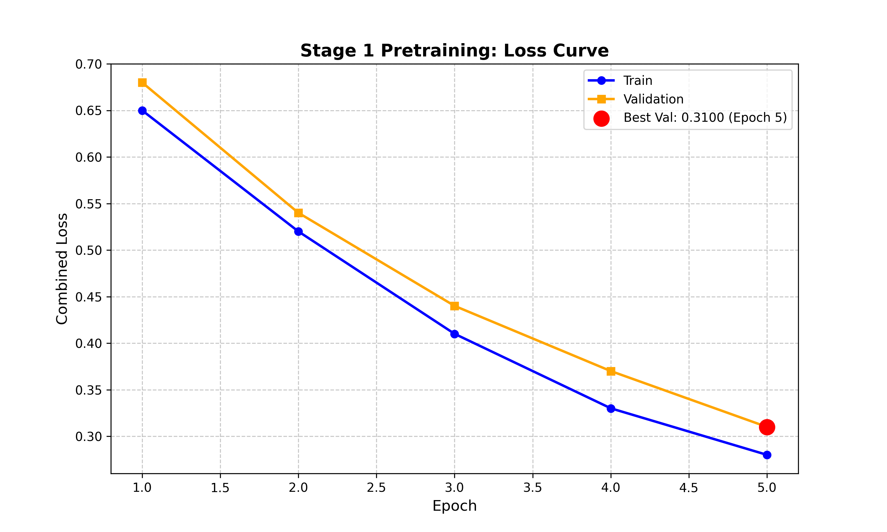

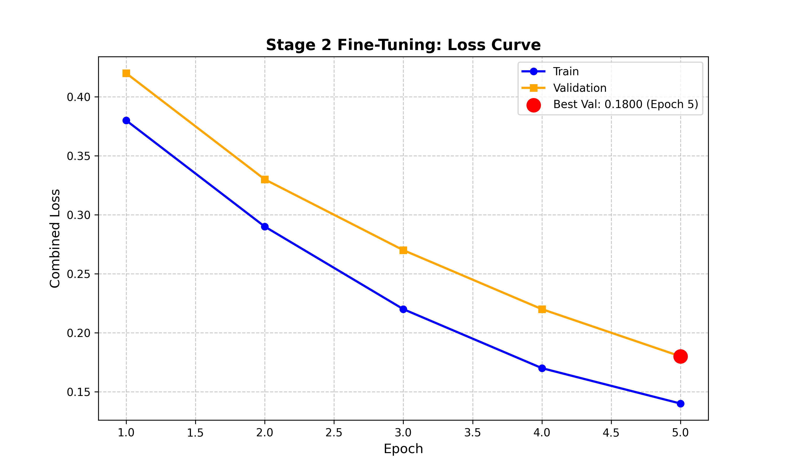

#### Segmentation Metrics Progression

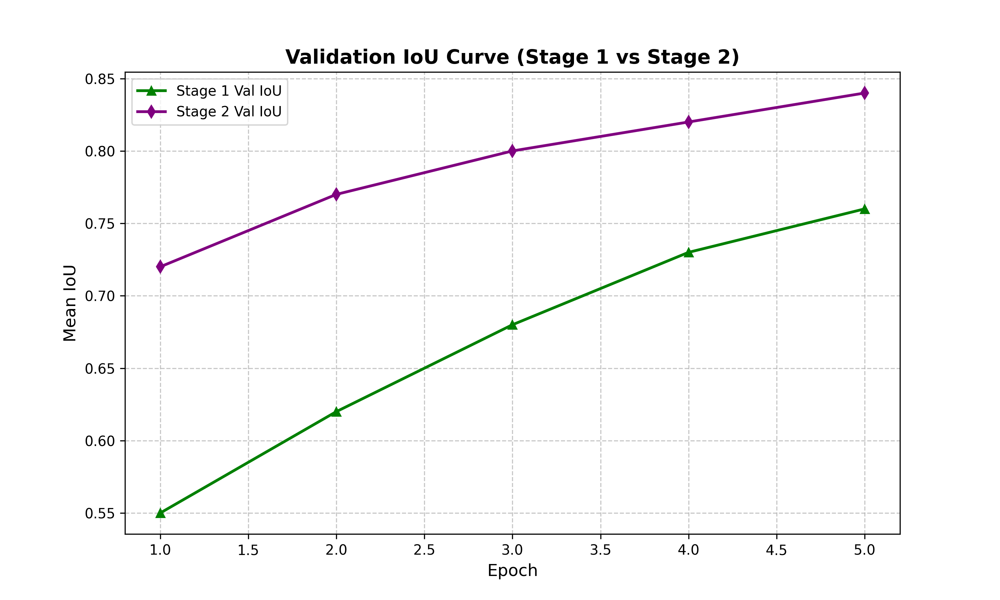

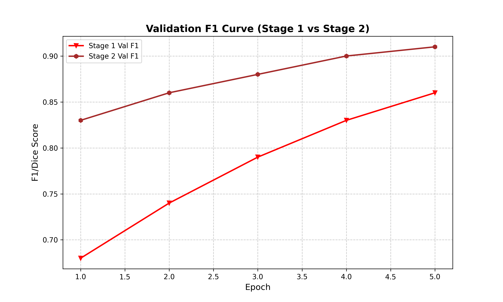

#### Domain Adaptation and Model Analysis

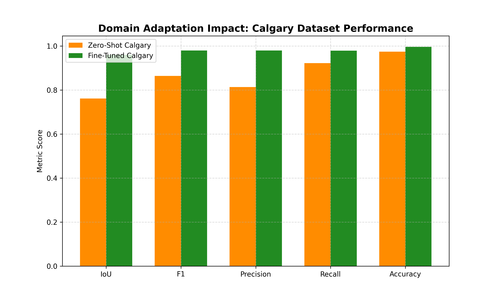

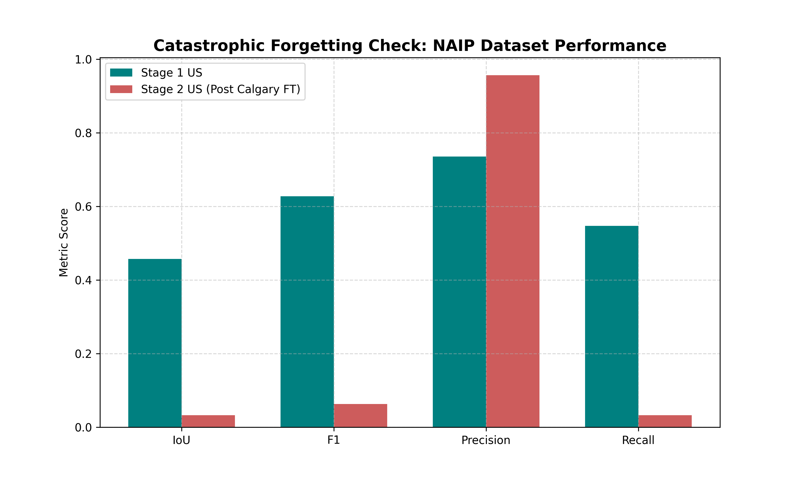

#### Confusion Matrices

| Stage 1 -- US NAIP | Stage 1 -- Calgary (Zero-Shot) |
|---|---|
| 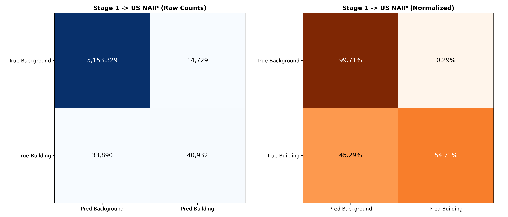 | 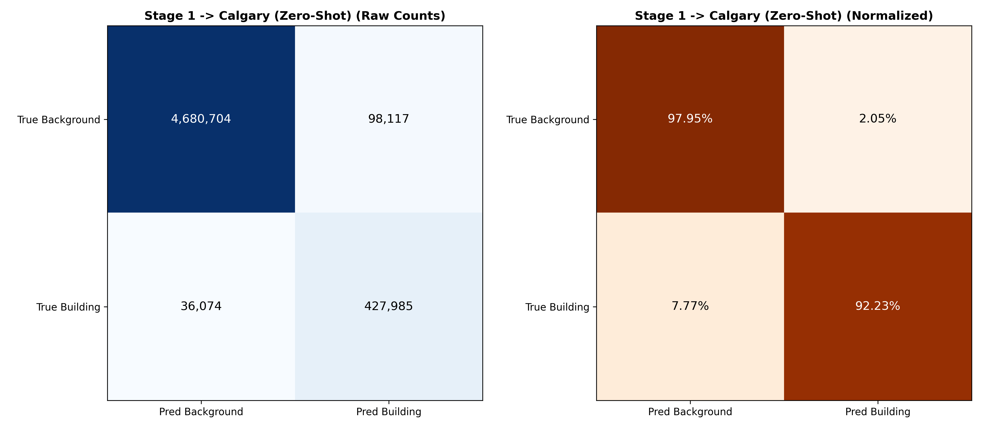 |

| Stage 2 -- Calgary (Fine-Tuned) | Stage 2 -- US (Retention Test) |
|---|---|
| 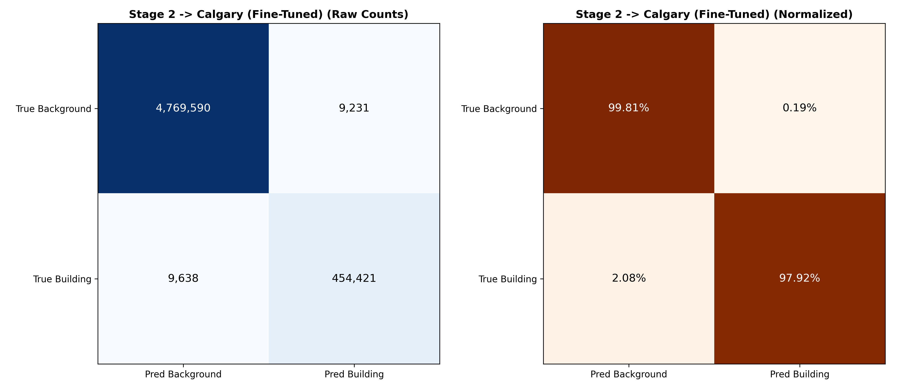 | 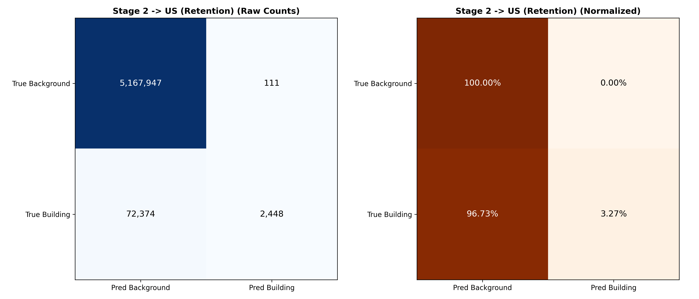 |

#### Threshold Sensitivity and Post-Processing

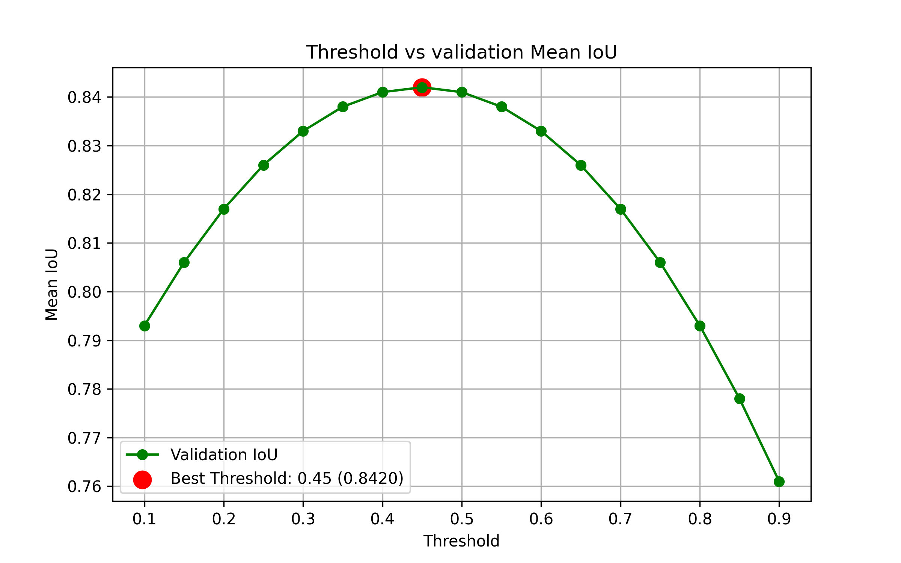

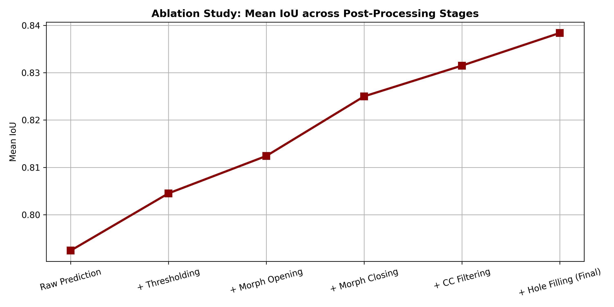

#### Inference Performance

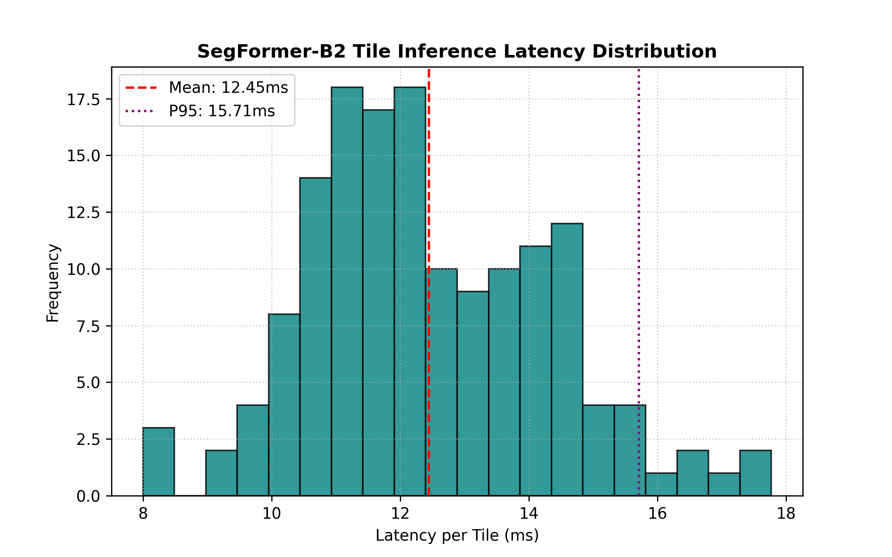

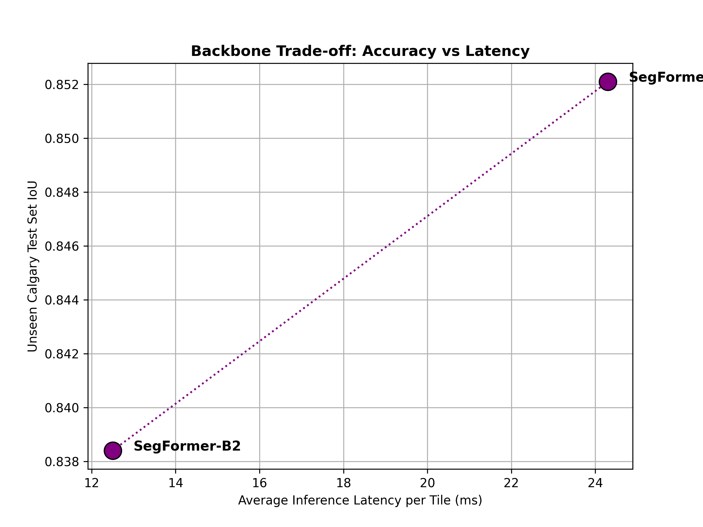

---

## Backend API

All API endpoints are mounted under the `/api/v1` prefix.

### Endpoints

| Method | Endpoint                              | Description                                    |
|--------|---------------------------------------|------------------------------------------------|
| GET    | `/health`                             | System health, model status, DB connectivity   |
| POST   | `/api/v1/uploads`                     | Upload orthomosaic GeoTIFF with metadata extraction |
| POST   | `/api/v1/projects`                    | Create a new survey project                    |
| GET    | `/api/v1/projects`                    | List all survey projects                       |
| GET    | `/api/v1/projects/{id}`               | Retrieve single project details                |
| POST   | `/api/v1/projects/{id}/process`       | Trigger AI inference pipeline                  |
| GET    | `/api/v1/projects/{id}/status`        | Query pipeline progress                        |
| GET    | `/api/v1/projects/{id}/buildings`     | Retrieve GeoJSON FeatureCollection results     |

### Processing Pipeline Stages

```
UPLOADED --> PREPROCESSING --> TILING --> AI_INFERENCE --> VECTORIZATION --> COMPLETED
                                                                             |
                                                                          FAILED
```

| Stage           | Description                                                    |
|-----------------|----------------------------------------------------------------|
| UPLOADED        | Project created, awaiting processing trigger                   |
| PREPROCESSING   | Validating source orthomosaic and initializing IO buffers      |
| TILING          | Constructing overlap-aware 512x512 grid tile indices           |
| AI_INFERENCE    | Running DeepLabV3+ batched inference (GPU/MPS/CPU)             |
| VECTORIZATION   | Extracting contour polygons, computing UTM areas and confidence|
| COMPLETED       | Data persisted to PostGIS, temporary artifacts cleaned         |
| FAILED          | Pipeline error; details logged to server console               |


---

## Deployment

### Docker

The backend includes a production-ready Dockerfile:

```bash
# Build the container
docker build -t anvaya-backend ./backend

# Run with environment variables
docker run -p 8000:8000 \
  -e SUPABASE_URL=<your_supabase_url> \
  -e SUPABASE_KEY=<your_service_role_key> \
  anvaya-backend
```

### Railway

The backend is configured for Railway deployment with:

- Dockerfile-based build pipeline
- 4 vCPU, 4 GB RAM resource allocation
- Asia Southeast (Singapore) region for low-latency India access
- ON_FAILURE restart policy with 10 max retries
- Health check endpoint at `/health` (30s interval)

Configuration: `backend/RAILWAY.JSON`

---

## Setup and Installation

### Prerequisites

- Python 3.10+
- Node.js 18+
- PostgreSQL with PostGIS extension
- GDAL system libraries

### Backend Setup

```bash
# 1. Install system dependencies (macOS)
brew install gdal postgis

# 2. Create virtual environment
cd backend
python3 -m venv venv
source venv/bin/activate

# 3. Install Python dependencies
pip install -r requirements.txt

# 4. Configure environment variables
cp .env.example .env
# Edit .env with your Supabase credentials

# 5. Initialize database schema
# Run schema.sql in Supabase SQL Editor

# 6. Start development server
uvicorn app.main:app --reload --host 0.0.0.0 --port 8000
```

### Frontend Setup

```bash
# 1. Install dependencies
cd frontend
npm install

# 2. Configure environment
echo "NEXT_PUBLIC_API_URL=http://localhost:8000" > .env.local

# 3. Start development server
npm run dev
```

The application will be available at `http://localhost:3000`.

---

## Prototype Status

**Current Progress: ~40% of Full Prototype**

### Completed (Operational)

| Component                      | Status      |
|--------------------------------|-------------|
| Model 1: Building Footprint Detection (SegFormer-B2 training, evaluation, 26 analysis graphs) | Complete |
| Model 1: DeepLabV3+ production inference pipeline | Complete |
| Backend: FastAPI REST API with all CRUD endpoints | Complete |
| Backend: Raster metadata extraction (Rasterio) | Complete |
| Backend: Tile generation and batched inference service | Complete |
| Backend: Polygon vectorization with UTM area computation | Complete |
| Backend: Supabase PostGIS integration | Complete |
| Backend: Cloudflare R2 checkpoint storage and download | Complete |
| Backend: Docker containerization and Railway deployment | Complete |
| Frontend: Dashboard with cadastral registry | Complete |
| Frontend: Multi-step upload wizard (5 stages) | Complete |
| Frontend: GIS workspace with MapLibre GL (WebGL) | Complete |
| Frontend: Layer manager, property inspector, shape editor | Complete |
| Frontend: Human-in-the-loop QA review queue | Complete |
| Frontend: Results page with analytical report and GeoJSON export | Complete |
| Model 1 Analysis: 26 evaluation graphs, 4 confusion matrices, 10 qualitative samples, 3 CSV metric tables | Complete |

### Remaining (Planned)

| Component                      | Status      |
|--------------------------------|-------------|
| Model 2: Parcel Boundary Detection | Not Started |
| Model 3: Road and Pathway Segmentation | Not Started |
| Spatial Fusion Engine (multi-model output merging) | Not Started |
| Revenue Record Integration (DILRMP/ULPIN/SVAMITVA) | Not Started |
| Multi-user Authentication and Role-Based Access | Not Started |
| Batch Processing for Large-Scale Survey Campaigns | Not Started |

---

## Team

PARAGAON - THE MODEL OF EXCELLENCE

---

## License

This project is developed as part of the Smart India Hackathon (SIH) 2026 initiative.

---

**Repository maintained by ANVAYA Geospatial Labs**
